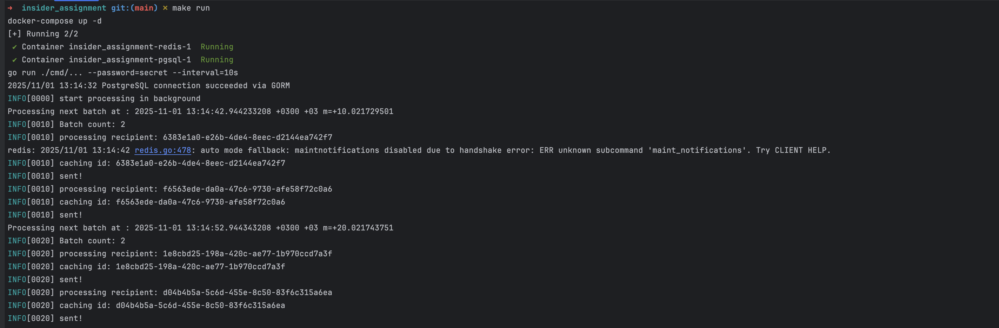

# Message Processor Service

Message Processor Service is a Go-based application that automatically sends messages stored in a PostgreSQL database, supports retrying failed messages, and caches sent messages in Redis. It also provides REST APIs to start/stop the message processor and retrieve sent messages.

### Prerequisites

- Docker & Docker Compose
- Go >= 1.25
- PostgreSQL
- Redis

This app is using Make commands to ease the usage.

### Start required services

```
make up
```

### Run migration files
````
make migrate
````

### Run the app
````
make run
````

The processor will start automatically when you run the app

Example with custom message sending interval:

go run ./cmd/... --password=secret --interval=10s

10s is used for quick follow instead of 2 minutes

### Swagger UI

You can view API documentation with Swagger UI:

````
make swagger-ui
````

## DB SCHEMA

````
CREATE TYPE message_status AS ENUM (
    'pending',
    'sent',
    'failed',
    'permanent_fail'
);

create table messages
(
    uuid                   uuid           default gen_random_uuid()         not null
        primary key,
    content                varchar(1000),
    recipient_phone_number varchar(20),
    status                 message_status default 'pending'::message_status not null,
    failed_count           integer        default 0                         not null,
    created_at             timestamp      default now()
);
````

The Swagger UI will be available at http://localhost:8090

### Make run Result

